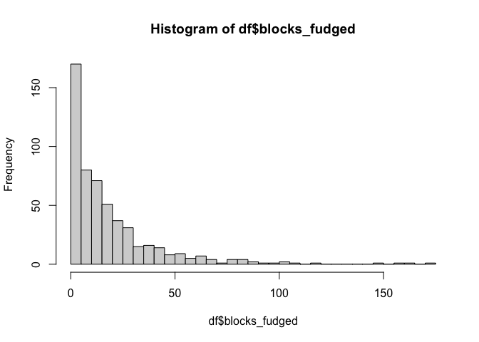
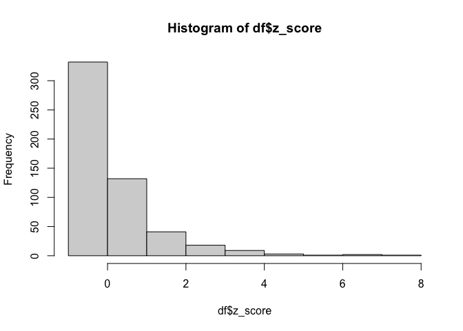
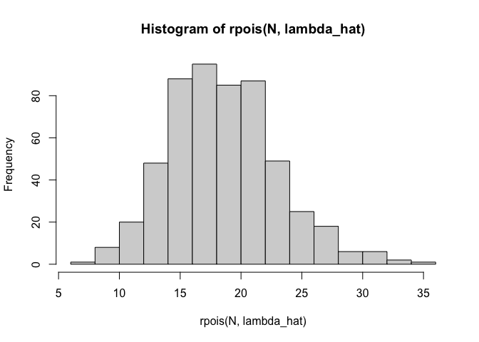
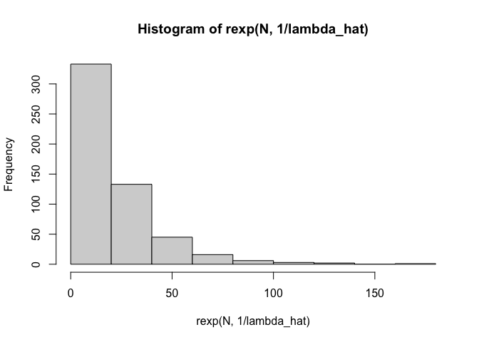
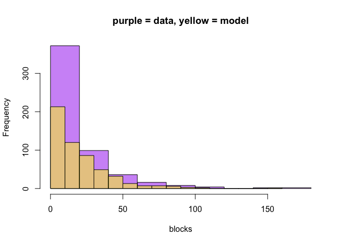
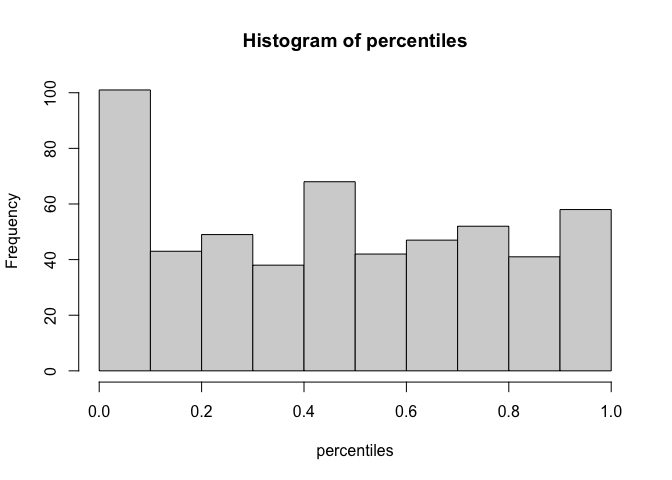
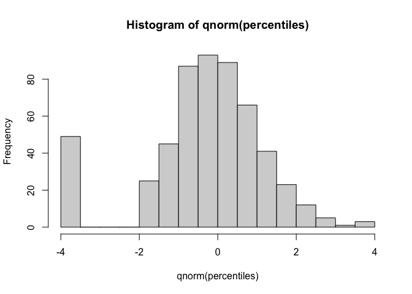
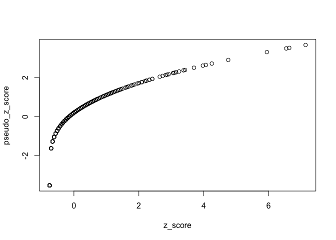

blocks
================
2023-09-04

i’m lazy and i don’t have block counts lying around so we’re going to
fudge block counts with (mins played) x (block %). close enough for the
demonstration here.

``` r
df = read_csv('~/Dropbox/funfund/data/vorp.csv') %>%
  select(
    season=Season,
    player=Player,
    pos=Pos,
    age=Age,
    team=Tm,
    block_pct=`BLK%`,
    mins=MP
  ) %>%
  mutate(
    blocks_fudged=round(block_pct * mins / 100),
    z_score = (blocks_fudged - mean(blocks_fudged)) / sd(blocks_fudged)
  ) %>%
  filter(season==2023)
```

    ## Rows: 6514 Columns: 29
    ## ── Column specification ────────────────────────────────────────────────────────
    ## Delimiter: ","
    ## chr  (4): Player, Pos, Tm, Player-additional
    ## dbl (25): Season, Rk, Age, G, MP, PER, TS%, 3PAr, FTr, ORB%, DRB%, TRB%, AST...
    ## 
    ## ℹ Use `spec()` to retrieve the full column specification for this data.
    ## ℹ Specify the column types or set `show_col_types = FALSE` to quiet this message.

``` r
hist(df$blocks_fudged, breaks=30)
```

<!-- -->

``` r
hist(df$z_score)
```

<!-- -->

``` r
lambda_hat = mean(df$blocks_fudged)
N = nrow(df)
```

if poisson distributed

``` r
hist(rpois(N, lambda_hat))
```

<!-- -->

so that doesn’t look great

let’s try exponential dist

``` r
hist(rexp(N, 1/lambda_hat))
```

<!-- --> well that
looks great!!

``` r
hist(df$blocks_fudged, col=alpha('purple', 0.5), main='purple = data, yellow = model', xlab='blocks')
hist(rexp(N, 1/lambda_hat), col=alpha('yellow', 0.5), add=T)
```

<!-- -->

let’s compute empirical “exponential scores”

these are going to be the percentile of the observation from 0 to 1

``` r
percentiles = pexp(df$blocks_fudged, rate=1/lambda_hat)
percentiles = ifelse(percentiles == 0, 0.0002, percentiles)
```

``` r
hist(percentiles)
```

<!-- -->

now clip these values and pretend these come from a normal dist

we still have a zeros problem but rad! this looks great

``` r
hist(qnorm(percentiles))
```

<!-- -->

let’s go look at the top players

``` r
df$percentiles = percentiles
df$pseudo_z_score = qnorm(percentiles)
```

``` r
df %>%
  arrange(-percentiles) %>%
  select(player, pos, block_pct, pseudo_z_score, z_score)
```

    ## # A tibble: 539 × 5
    ##    player            pos   block_pct pseudo_z_score z_score
    ##    <chr>             <chr>     <dbl>          <dbl>   <dbl>
    ##  1 Jaren Jackson Jr. C           9.6           3.68    7.14
    ##  2 Nic Claxton       C           7.1           3.53    6.63
    ##  3 Brook Lopez       C           6.7           3.50    6.54
    ##  4 Walker Kessler    C           8.6           3.31    5.94
    ##  5 Myles Turner      C           6.6           2.91    4.75
    ##  6 Evan Mobley       PF          4             2.72    4.25
    ##  7 Joel Embiid       C           4.6           2.65    4.06
    ##  8 Mitchell Robinson C           6.5           2.62    3.97
    ##  9 Anthony Davis     C           5.1           2.51    3.70
    ## 10 Onyeka Okongwu    C           4.9           2.40    3.42
    ## # … with 529 more rows

``` r
plot(pseudo_z_score ~ z_score, data=df)
```

<!-- -->
